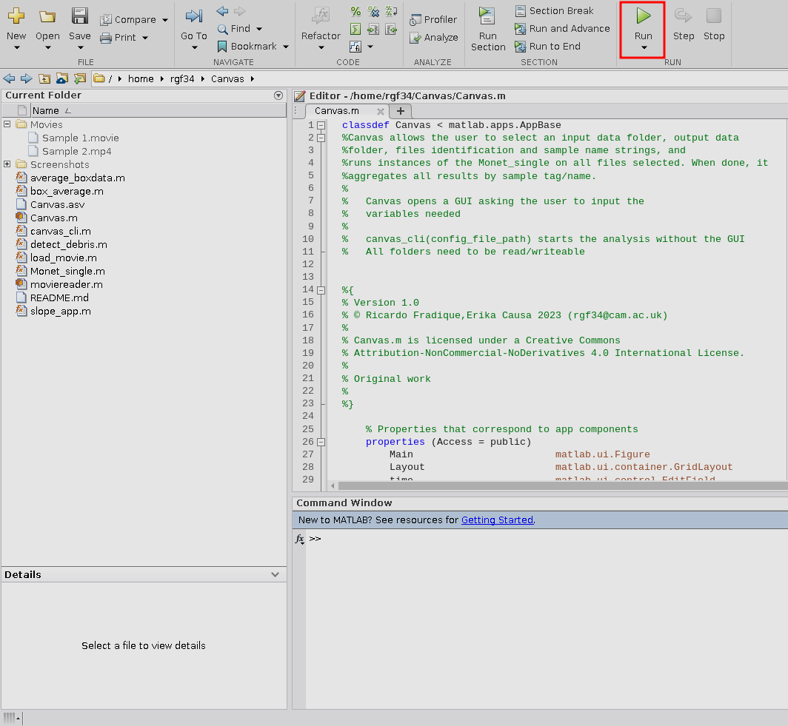
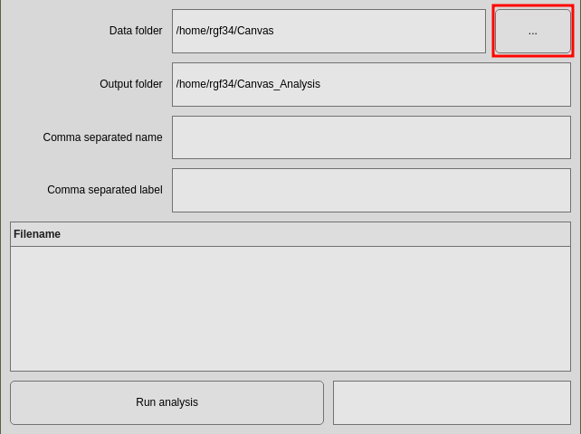
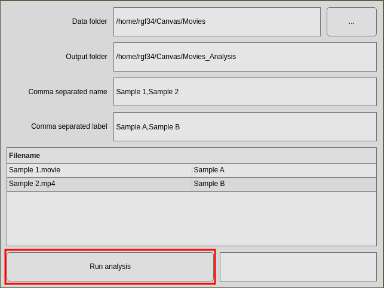
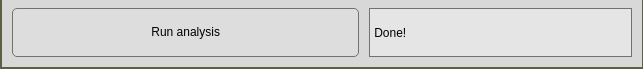

# Cilia beating frequency and Coverage analysis

This file provides a simple guide to running CBF and coverage analysis on a series of videos, using the enclosed MATLAB functions. Included are a CLI and a GUI versions of the analysis function, an example cfg file, and two example videos.

This code submission is part of the Supplementary Information of the following publication:

* 

## Installation

This code depends on several MATLAB toolboxes:
* Signal Processing Toolbox
* Image Processing Toolbox
* Statistics and Machine Learning Toolbox
* Parallel Computing Toolbox
* MATLAB Parallel Server
* Polyspace Bug Finder

With all dependencies satisfied, download or clone this repository, navigate to its folder, and run Canvas.m.
If run from the install folder, it will add all needed files to the path, otherwise [add the repository's folder (and its subfolders) to your MATLAB path](https://uk.mathworks.com/help/matlab/ref/addpath.html).

## CBF and Coverage analysis
The analysis function will first run through each video file, and save a `.mat` file for each input file, containing the Background map, Frequency map, Measured Frequency vector, and a debris/focusing flag. It will also save a figure for each sample with an overview of the frequency and coverage for the individual field of view.
If any sample tags are used, it will then proceed to aggregate all data by sample type/tag. This creates several output files:
* CSV for each sample type/tag, with each filename included, Coverage %, Median frequency, and 25th-75th percentiles
* Aggregated CSV, containing the same information as above, accumulated over all the files included. That is, the general description from all fields of view of a particular sample
* Box plot of the Coverage % and frequency distribution for all samples

A detailed flow diagram of the algorithm used is included [here](https://github.com/rgfradique/Canvas/blob/main/Screenshots/Flow%20diagram.png).

# GUI Use
To use, open the Canvas folder in your matlab UI, and navigate to the `Canvas.m` file.
When done, click the Run button on the top right:

When run, this file will open the GUI where you can set:
* The path to the data input folder (by default it will include all `.movie`, `.mp4`, and `.avi`files in the folder)
* The path to the output folder (by default it will try to create a folder with the same name as the input, plus `_Analysis`)
* Comma separated sample names. Each string here is used as a filter to include files in the input folder that contain the string in their names. Leave empty to include all files
* Comma separated label. Each string is used as a label for each sample name. This is used to e.g. have `Sample1` plotted as `Day 1` in the output.
Click the top right button to select the input folder containing the sample videos

When all the inputs are correctly inserted, click the `Run analysis` button to begin the analysis.

The bottom right field will display an approximated runtime for your operations, and will change when the analysis is finished.

You can find your results in the output folder. For comparison, there's an `Expected Results` folder included with the analysis obtained from 2 different example movies.

## Config save
On the first run, a `sample_settings.cfg` file is created in the output folder. This is a json file with the structure:
[
    "input folder",
    "output folder",
    "sample names",
    "sample tags"
]

This file is pre-loaded everytime the output folder is selected, to avoid having to re-enter all the sample information.

# CLI Use
To make it easier to use the software in a more automated fashion, there's also a cli version that makes use of a `sample_config.cfg` file to run the analysis over multiple files.
To use it, call `canvas_cli.m` from the MATLAB cli with:
`matlab -nodisplay -nodesktop -nosplash -logfile *change to matlab log file path*/matlab_run.log -r "canvas_cli('*change to config location path*/sample_settings.cfg'); exit"`
